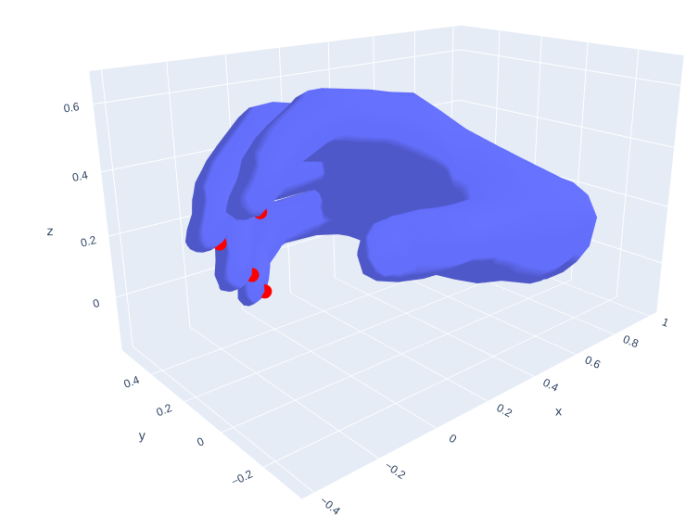
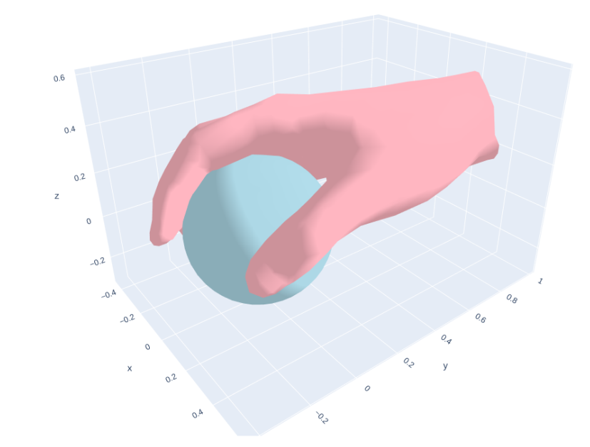

# Diverse and Stable Grasp

In this code, we can easily run this project with the command as `python3 synthesis.py` for the estimated force closure with data-driven. So we need to concentrate on the `synthesis.py` file. In this file, the several models are created and running with estimation and refinement.

## Environment Setting

Before creating the models, we need to import the packages and setting the arguments which are used in this project.

```python
import argparse
import os
import random
import numpy as np
import torch
import trimesh as tm
from plotly import graph_objects as go
import utils.visualize_plotly
```

```python
parser = argparse.ArgumentParser()
parser.add_argument('--batch_size', default=1024, type=int)
parser.add_argument('--n_contact', default=5, type=int)
parser.add_argument('--max_physics', default=10000, type=int)
parser.add_argument('--max_refine', default=1000, type=int)
parser.add_argument('--hand_model', default='mano', type=str)
parser.add_argument('--obj_model', default='sphere', type=str)
parser.add_argument('--langevin_probability', default=0.85, type=float)
parser.add_argument('--hprior_weight', default=1, type=float)
parser.add_argument('--noise_size', default=0.1, type=float)
parser.add_argument('--mano_path', default='data/mano', type=str)
parser.add_argument('--output_dir', default='synthesis', type=str)
args = parser.parse_args()
```

Then, the utilizable models and functions are created in the `utils` fold. This folder includes the most of usable models and something core components. Thus we need to import this folder.

```

from utils.HandModel import HandModel
from utils.Losses import FCLoss
from utils.ObjectModel import DeepSDFModel, SphereModel
from utils.PenetrationModel import PenetrationModel
from utils.PhysicsGuide import PhysicsGuide
```

## Class Model Creation

### Object Model

We need to define the object model to be grasped at first. The complicated model will be used `DeepSDF` Model to simulate the surface and contact. Or, the simple sphere model can be simply generate the value which we concentrate on. 

```python
if args.obj_model == 'bottle':
    object_model = DeepSDFModel(
        predict_normal=False, 
        state_dict_path="data/DeepSDF/2000.pth",
        code_path = 'data/DeepSDF/Reconstructions/2000/Codes/ShapeNetCore.v2/02876657',
        mesh_path = 'data/DeepSDF/Reconstructions/2000/Meshes/ShapeNetCore.v2/02876657')
    object_code, object_idx = object_model.get_obj_code_random(args.batch_size)
elif args.obj_model == 'sphere':
    object_model = SphereModel()
    object_code = torch.rand(args.batch_size, 1, device='cuda', dtype=torch.float) * 0.2 + 0.1
else:
    raise NotImplementedError()
```

### Hand Model

This project use the open-sourced project named `mano` which is presented at CVPR previously. The main codes are included in the `thirdparty` folder and the `HandModel.py` will generate a hand model class to simulate.

```python
hand_model = HandModel(
    n_handcode=45,
    root_rot_mode='ortho6d', 
    robust_rot=False,
    flat_hand_mean=False,
    mano_path=args.mano_path, 
    n_contact=args.n_contact)
```



The `mano` is using the torch layer with the name of `manolayer` and it accept the pose coefficients as the input and compute the vertices and joint. So in the main function, we generate the 1 by 15 random tensor and use it as the pose coefficients to generate vertices. And the index of every finger tips are constants. So after generate the vertices, the position of every fingertips can be pointed with the constant index.

```python
  hand_model = HandModel()
  z = torch.normal(0,1,size=[1,30]).float().to(hand_model.device) * 1e-6  # tensor [0.1 -0.1 ... 0.1]   1*15
  verts = hand_model.get_vertices(z)
  dense_verts = hand_model.get_vertices_dense(z)
  verts = verts[0].detach().cpu().numpy()
  dense_verts = dense_verts[0].detach().cpu().numpy()
  fti = hand_model.fingertip_indices.detach().cpu().numpy()

  fig = go.Figure(data=[
    go.Mesh3d(x=verts[:,0], y=verts[:,1], z=verts[:,2], i=hand_model.faces[:,0], j=hand_model.faces[:,1], k=hand_model.faces[:,2]),
    go.Scatter3d(x=verts[fti, 0], y=verts[fti, 1], z=verts[fti, 2], mode='markers', marker=dict(size=5, color='red'))
  ])
  fig.show()
```

### FC Loss

As the paper mentioned, to allow gradient-based optimization, we further cast the force closure equations as a soft constraint in the form:
$$
FC(x,O) = \lambda_0^{-}(GG^{'}-\epsilon I_{6\times6})+\|Gc\|_2 + \omega \Sigma_{x_i \in x}d(x_i, O)
$$
So, in this function, we have three parts to compute. The first part is named `loss_8a` function with $\lambda_0^{-}(GG^{'})$:

```python
  def loss_8a(self, G):
    """
    G: B x 6 x 3N
    """
    Gt = G.transpose(1,2)
    temp = self.eps * self.eye6
    temp = torch.matmul(G, Gt) - temp
    # eigval = torch.symeig(temp.cpu(), eigenvectors=True)[0].to(self.device)
    eigval = torch.linalg.eigh(temp.cpu(), UPLO='U')[0].to(self.device)
    rnev = self.relu(-eigval)
    result = torch.sum(rnev * rnev, 1)
    return result
```

and  $\|Gc\|_2 $ :

```python
  def loss_8b(self, f, G): 
    """
    G: B x 6 x 3N
    f: B x N x 3
    """
    B = f.shape[0]
    N = f.shape[1]
    return self.relu(self.l2_norm(torch.matmul(G, f.reshape(B, 3*N, 1))))
```

and $\omega \Sigma_{x_i \in x}d(x_i, O)$:

```python
  def loss_8c(self, normal):
    """
    normal: B x N x 3
    friction: B x N x 3
    x: B x N x 3
    mu: ()
    """
    normal = normal / torch.norm(normal, dim=-1, keepdim=True)
    left = torch.einsum('ijk, ijk->ij', normal, normal)
    right = torch.norm(normal, dim=2) / self.sqrt_sq_mu_1
    diff = left - right
    return torch.sum(self.relu(-diff), 1)
```

And we can generate the contact points randomly and to compute the soft constraints to get the appropriate force to complete the force closure:

```python
import matplotlib.pyplot as plt
from mpl_toolkits.mplot3d import Axes3D
plt.ion()
ax = plt.subplot(111, projection='3d')

n = 1500

fc = FCLoss(None)
x = torch.tensor(np.random.random([1, n, 3]), requires_grad=True).float().cuda()
f = torch.tensor(np.random.random([1, n, 3]), requires_grad=True).float().cuda()
f = f / torch.norm(f, dim=-1, keepdim=True)
G = fc.x_to_G(x)
while True:
	ax.cla()
	ax.quiver(np.zeros([n]), np.zeros([n]), np.zeros([n]), f.detach().cpu().numpy()[0,:,0], f.detach().cpu().numpy()[0,:,1], 		f.detach().cpu().numpy()[0,:,2], length=0.1, normalize=True, color='red')
	plt.pause(1e-5)

	l8b = fc.loss_8b(f, G)

	grad = torch.autograd.grad(l8b, f)[0]
	f = f - grad * 0.00001
	f = f / torch.norm(f, dim=-1, keepdim=True)
```

If the points are large, the grade scale need to be smaller as well.

### Physics Guide

In this module, we compute the energy function between the hand model and the object model to optimize. We formulate the grasp synthesis problems as sampling from a conditional Gibbs distribution. In the `compute_engergy` function, the object code and coefficient will be computed as input and the contact point indices will be used to compute contact points. And then the normal alignment and surface distance can be computed. The output of energy will be formulated as `linear_independence, force_closure, surface_distance.sum(1), penetration.sum(1), hand_prior, normal_alignment`

And the `optimize` function will be used to get the minimize the energy and get the appropriate minimum energy with contact constraint or other constraints. Then `refine` function will be used to refining the previous output.

```python
energy, grad, verbose_energy = physics_guide.initialize(object_code, z, contact_point_indices)
linear_independence, force_closure, surface_distance, penetration, z_norm, normal_alignment = verbose_energy
accept = ((force_closure < 0.5) * (penetration < 0.02) * (surface_distance < 0.02)).float()
for physics_step in range(args.max_physics):
    energy, grad, z, contact_point_indices, verbose_energy = physics_guide.optimize(energy, grad, object_code, z, contact_point_indices, verbose_energy)
    linear_independence, force_closure, surface_distance, penetration, z_norm, normal_alignment = verbose_energy
    accept = ((force_closure < 0.5) * (penetration < 0.02) * (surface_distance < 0.02)).float()
    _accept = accept.sum().detach().cpu().numpy()
    accept_history.append(_accept)
    if physics_step % 100 == 0:
        print('optimize', physics_step, _accept)

for refinement_step in range(args.max_refine):
    energy, grad, z, contact_point_indices, verbose_energy = physics_guide.refine(energy, grad, object_code, z, contact_point_indices, verbose_energy)
    linear_independence, force_closure, surface_distance, penetration, z_norm, normal_alignment = verbose_energy
    accept = ((force_closure < 0.5) * (penetration < 0.02) * (surface_distance < 0.02)).float()
    _accept = accept.sum().detach().cpu().numpy()
    accept_history.append(_accept)
    if refinement_step % 100 == 0:
        print('refine', refinement_step, _accept)
```

## Result



# Original Documents:


# diverse-and-stable-grasp
This repository shares the code to replicate results from the paper **Synthesizing Diverse and Physically Stable Grasps with Arbitrary Hand Structures using Differentiable Force Closure Estimation** [[arxiv](https://arxiv.org/abs/2104.09194)] [[project](https://sites.google.com/view/ral2021-grasp/home)]

We tested our code with `Python 3.8`, `PyTorch 1.9` and `CUDA 11.1`. However, the code should work with any recent version of PyTorch. 

## Dependencies
* Numpy
* Trimesh
* Plotly
* PyTorch
* [manopth](https://github.com/hassony2/manopth)

## Download data
* Signup and download the license-protected hand model file `MANO_RIGHT.pkl` from [http://mano.is.tue.mpg.de] and place it in `data/mano/`. 
* Download DeepSDF model weights and other related files from [Google Drive](https://drive.google.com/file/d/1GtH07I_4OtpCC_vzFUihRZJHsoj3KtHN/view?usp=sharing) and extract into `data/`

## Run
Run `python synthesis.py` to run our grasp synthesis algorithm with 1024 parallel syntheses, a MANO hand, and spheres with random radius. Synthesized examples that satisfy the constraints in Eq. 11 are stored in `synthesis/`. The demo code `synthesis.py` supports the following arguments: 
* `--batch_size`: number of parallel syntheses. Default: `1024`
* `--n_contact`: number of contact points. Default: `5`
* `--max_physics`: number of optimization steps. Default: `10000`
* `--max_refine`: number of refinement steps. Set to `0` to turn off refinement. Default: `1000`
* `--hand_model`: choice of `['mano', 'mano_fingertip']`. Default: `'mano'`
* `--obj_model`: choice of `['bottle', 'sphere']`. Default: `'bottle'`
* `--langevin_probability`: chance of choosing Langevin dynamics over contact point sampling in optimization steps. Default: `0.85`
* `--hprior_weight`: weight of $E_\mathrm{prior}$. Default: `1`
* `--noise_size`: size of noise used in Langevin dynamics. Default: `0.1`
* `--mano_path`: path to MANO parameters. Default: `'data/mano'`
* `--output_dir`: path to store synthesis results. Default: `'synthesis'`